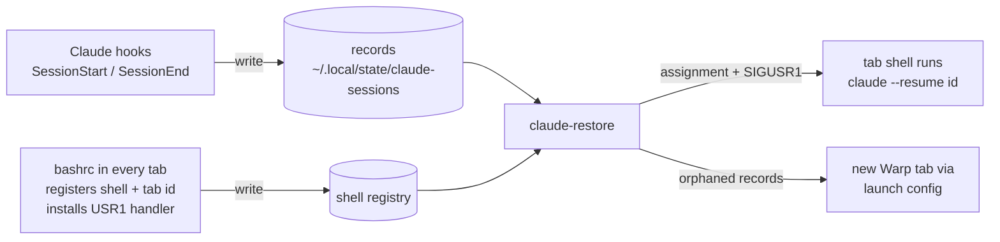
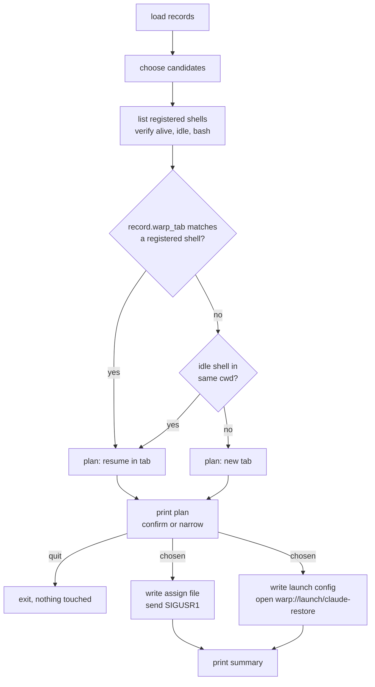

# Claude session restore for Warp

Sep 21, 2026 · Matthew Sweeney

Canonical copy of the design. The review copy with its comment threads is a Claude Doc: https://claude.ai/code/artifact/ae63590c-e406-4244-add6-336c9f073ae4

## Goal

One command, run once from any tab after a restart, puts every Claude Code session back into the exact Warp tab it was running in before the machine went down.

Today a macOS update restart brings Warp back with all tabs open in their old directories, but the Claude sessions inside them are gone. Each one has to be reopened by hand through the resume picker, and it is easy to skip some. Three of the tabs Warp restored on Aug 9 are still sitting empty today.

The finished behavior:

- `claude-restore` works out which sessions were running at shutdown and which tab each belonged to.
- Each session resumes inside its own tab, so the tab's scrollback and the session's name stay together.
- A session whose tab no longer exists gets a fresh tab. Tabs that had no Claude session are left alone.
- Two tabs open in the same directory each get their own session back, not a guess.
- The command prints what it is about to do and can be run as a dry run first.

## What was verified

Everything below was tested on this machine with throwaway sessions on Sep 18, Claude Code 2.1.277 and Warp 0.2026.08.05.

| Question | Result | Consequence |
| --- | --- | --- |
| Does SessionEnd fire when a session is killed by SIGHUP or SIGTERM, as at shutdown? | Yes, with reason `other`. A `/exit` gives `prompt_input_exit`. Headless `claude -p` runs also end with `other`. | Records must be kept on `other` and deleted only on user exits. Print-mode runs must never create a record. |
| What does the SessionStart payload carry? | `session_id`, `cwd`, `transcript_path`, `source`, and `session_title` when the session was named with `-n`. Unnamed sessions get an auto-derived name that is not in the payload. | The hook has what it needs. The title is a nicety, not a requirement. |
| Can the hook tell print mode from interactive? | Yes. The hook's parent process is Claude itself, and its command line is readable. | Filter on `-p` / `--print` in the parent command line. |
| Does resume keep the session name? | Yes. The resumed session reported `source: resume` and the original title, and Claude sets the tab title itself. | No need to pass `-n` on resume. |
| What if the transcript is missing? | `claude --resume <id>` silently starts a new session instead of failing. Sessions with no messages have no transcript at all. | Check the transcript exists before resuming anything. |
| Can a tab be identified across a restart? | Each tab shell has `WARP_TERMINAL_SESSION_UUID`. It equals the pane uuid in Warp's database, and panes restored on Aug 9 still carry blocks from July 3 under the same id. | Exact tab matching by id, no directory guessing. |
| Can anything type into an existing tab from outside? | No. But an idle bash at its prompt runs a SIGUSR1 trap immediately, can launch Claude in the foreground, and gets its prompt back after `/exit`. | The restore command signals the tab's own shell, which does the launch. |
| Can Warp's database say which tabs had Claude at shutdown? | No. Warp stores a block only when the command finishes. There are zero `claude` blocks and zero unfinished blocks. | The hook records are the only source of truth. |
| Can the environment of a running Claude process be read? | Yes, with `ps -Eww` on a same-user process. | The 15 sessions already running can be seeded with their tab ids. |
| Do Warp launch configurations work from a script? | Yes. `open "warp://launch/<name>"` opened a window, ran the commands, and handled a directory with spaces. | Used only as the fallback for records whose tab is gone. |

Two things are also true of Claude's own bookkeeping. The live registry under `~/.claude/sessions/` lists every running interactive session with its id, directory, name, and pid, and it is removed on exit, so it is useful for seeding and titles but not after a reboot. And running sessions do not pick up newly installed hooks until they restart.

## Design overview

Three small pieces, all in the dotfiles repo: hooks that record sessions while they run, a bashrc snippet that lets each tab's shell be reached, and one command that joins the two after a restart.



Reading the diagram: while you work, every interactive session writes a record that names its session id, directory, and Warp tab id. Every tab shell registers itself so the restore command knows it can be signaled. After a restart, `claude-restore` pairs records to registered shells by tab id, hands each shell its session id, and signals it. The shell launches `claude --resume` in the foreground, in its own tab.

Design choices worth stating:

- Tab identity comes from `WARP_TERMINAL_SESSION_UUID`, which Claude inherits and the hook records. Directory is only a fallback.
- The shell launches Claude as a foreground child, not with `exec`, so `/exit` returns the tab to a normal prompt as usual.
- Records are deleted only on clean user exits. Anything that ended by signal, crash, or hard kill stays, because that is exactly what a shutdown looks like from inside the session.
- No dependence on Warp's database or on Claude's undocumented registry for correctness. Both are read only to seed the initial records and to decorate titles.

## Recording sessions

One script, `claude-session-track`, handles both hook events and writes one JSON file per session under `~/.local/state/claude-sessions/`.

On **SessionStart** it:

1. Reads the payload from stdin: session id, cwd, transcript path, source, and `session_title` if present.
2. Looks at its parent process, which is Claude. If the command line contains `-p` or `--print`, it exits without writing. Headless runs never get a record.
3. Takes the tab id from `WARP_TERMINAL_SESSION_UUID` in its own environment. Missing means the session was not started in Warp; the record is still written, with no tab id.
4. Fills the title from `session_title`, else from the derived name in Claude's live registry entry for the parent pid, else from the directory basename.
5. Writes the record atomically (temp file, then rename), overwriting any existing record for the same session id. A resume therefore refreshes the record with the current tab.

On **SessionEnd** it reads the reason. `prompt_input_exit`, `clear`, and `logout` delete the record. `other` and anything unrecognized stamp the record with `ended_at` and the reason and leave it in place.

Optionally the same script runs on **Stop** to refresh the title after a `/rename`. That costs one small process per turn and can be left out at first.

Record format:

```json
{
  "session_id": "52efb32f-5010-4eca-bc91-75cb12c0ceee",
  "cwd": "/Users/sweeney/.dotfiles",
  "transcript_path": "/Users/sweeney/.claude/projects/-Users-sweeney--dotfiles/52efb32f-....jsonl",
  "title": "dotfiles",
  "warp_tab": "0fc099e10b5e423d9e5be87736f4fb4a",
  "started_at": "2026-09-18T19:08:53Z",
  "ended_at": null,
  "end_reason": null
}
```

The hooks are registered in `~/.claude/settings.json`, which is not in the dotfiles repo today. The entry is small:

```json
"hooks": {
  "SessionStart": [{"hooks": [{"type": "command", "command": "~/.local/bin/claude-session-track"}]}],
  "SessionEnd":   [{"hooks": [{"type": "command", "command": "~/.local/bin/claude-session-track"}]}]
}
```

The script needs `jq`, which is already installed at `/opt/homebrew/bin/jq` and is also required by the Warp plugin you use.

## Shell registration

A short block in `bashrc.symlink`, guarded so it only runs in an interactive shell with a tty, makes each tab reachable by the restore command.

On shell start it:

1. Writes `~/.local/state/claude-sessions/shells/<pid>` containing the shell pid, its process start time, the tab id from `WARP_TERMINAL_SESSION_UUID`, and the tty. Non-Warp shells register too, with no tab id, so the same mechanism works from Terminal.app if ever needed.
2. Installs a handler for SIGUSR1. The handler reads `~/.local/state/claude-sessions/assign/<pid>`, removes it, and if it names a session id runs `claude --resume <id>` in the foreground. When Claude exits the handler returns and the shell is back at its prompt.
3. Installs an EXIT trap that removes the registration file.

Why a signal: bash processes a trapped signal immediately while it is idle at the prompt, which is exactly the state of a freshly restored tab. This was tested: the handler fired at once, Claude ran in that terminal, and `/exit` handed the prompt back.

Why the assignment file rather than putting the id in the signal: signals carry no data, and a file per shell lets the handler refuse anything not meant for it.

The handler does nothing if there is no assignment file, so a stray signal is harmless once the trap is installed. The danger is the other way around: a shell that never installed the trap dies on SIGUSR1. That is why the restore command signals only shells that registered themselves, and the registration and the trap are written by the same lines of bashrc so one cannot exist without the other.

The registration file is also what tells the restore command a shell is *idle*: before signaling, it checks the pid is still bash, its start time matches the file, and it has no child processes. A tab where you already started something, or where Claude is already running, is skipped.

## The restore command

`claude-restore` runs once, from any tab, and does the whole job in one pass. It lives in `bin/` and installs to `~/.local/bin` like `gws`.



**Choosing candidates.** A record qualifies when its transcript exists, its session is not already running, and either it has no end stamp at all or its end stamp sits within two minutes of the newest end stamp across all records. At shutdown every session dies within seconds of each other, so that cluster is the set that went down with the machine. A record that ended earlier, for example a tab you closed with Cmd-W a week ago, is not restored by default. `--all` includes those, and `--pick` opens an fzf multi-select over everything.

**Matching.** Tab id first, exact. If the record's tab is gone, fall back to an idle registered shell in the same directory that has not already been claimed in this run. Two tabs in the same directory are therefore paired by id, and the fallback only ever fills a tab that has nothing else coming to it.

**Plan and confirm.** Nothing is resumed until you approve it. Once the pairs are matched the command prints the plan — a row per record with title, directory, age, and the action it will take (resume in tab, new tab, skip and why) — and waits. Enter accepts the plan, a list of row numbers keeps only those rows, `p` hands the same list to fzf for a multi-select, and `q` exits without touching a shell. The two non-interactive flags sit either side of that prompt: `--dry-run` prints the plan and stops, `--yes` accepts it unseen. With no TTY, the command prints the plan and exits unless `--yes` is given.

**Signaling.** For each pair the command writes the session id into the shell's assignment file, then sends SIGUSR1. It waits briefly and checks the shell now has a `claude` child. If not, it reports the tab as needing a manual `claude --resume <id>` and moves on.

**Orphans.** Records with no usable shell are written into a Warp launch configuration, one tab per session with the right cwd and `claude --resume <id>`, and opened with `open "warp://launch/claude-restore"`. This path is the one verified earlier.

**Output.** A table of what happened: title, directory, session id, and the action taken (resumed in tab, new tab, skipped and why).

Flags:

| Flag | Effect |
| --- | --- |
| `--yes` | Skip the confirmation prompt and restore the whole plan. |
| `--dry-run` | Print the plan and exit without prompting. |
| `--list` | Show every record with its state, age, and whether a matching tab is open. |
| `--all` | Include records outside the shutdown cluster. |
| `--pick` | Go straight to the fzf multi-select instead of the plan prompt. |
| `--prune` | Delete records whose transcript is gone or whose session is older than Claude's cleanup window. |
| `--seed` | Create records for sessions already running, see below. |
| `--focus` | After resuming, cycle focus through the restored tabs with `open warp://session/<id>`. |

## Seeding the sessions already running

The 15 sessions open right now started before any hook existed, and a running session does not load a newly installed hook until it restarts. Without a seed, the first restart after install would lose all of them.

`claude-restore --seed` writes a record for each of them from information that is already available:

1. Claude's live registry under `~/.claude/sessions/` gives every running interactive session's pid, session id, directory, and name.
2. `ps -Eww` on that pid reads the process environment, which includes `WARP_TERMINAL_SESSION_UUID`. This was checked: the Convertible Note session maps to the Convertible Note tab.
3. The transcript path follows from the directory slug and the session id.

The seed never overwrites a record the hooks have already written, so it is safe to rerun. Once a seeded session restarts through the hooks, the hook record takes over.

One limitation until then: a seeded session is not hook-tracked, so exiting it by hand before the first restart leaves its record with no end stamp, and it will show up in the next plan once. It is one row to drop at the prompt, and the record is replaced the moment the session is resumed through the hooks.

One run of `--seed` right after installing is the whole step. It can also be run any time as a belt-and-braces check that every running session has a record.

## Edge cases and safety guards

| Situation | What happens |
| --- | --- |
| A tab was closed with Cmd-W before the restart | Its session ended by SIGHUP with reason `other`, so the record survives with an end stamp from that day. It falls outside the shutdown cluster and is not restored unless `--all` or `--pick` asks for it. |
| Claude crashed or was killed hard | No SessionEnd, no end stamp. The record is treated as a shutdown victim and restored. |
| Two tabs in the same directory | Paired by tab id. If one tab is gone, only an unclaimed idle shell in that directory can take its session. |
| The record's tab exists but is busy, or already running Claude | Skipped and listed in the summary. Nothing is signaled. |
| The transcript is gone (Claude's 30-day cleanup, or a session that never had a message) | Skipped, because resuming would silently start a new session. `--prune` deletes such records. |
| A `claude -p` run from a script or a hook | Never recorded. The hook checks its parent's command line. |
| A session started outside Warp | Recorded with no tab id. It can only match by directory or go to a new tab. |
| `/clear` inside a session | SessionEnd with reason `clear` deletes the old record; SessionStart with source `clear` writes the new one. |
| Resuming a session in a different tab than it came from | The resume's SessionStart rewrites the record with the new tab id. |
| A pid in the shell registry was reused by another process | The registry stores the process start time; a mismatch means the entry is stale and is ignored and removed. |
| `claude-restore` run twice | The second run finds every session already running and does nothing. |

Signal safety is the one place a bug could hurt, since SIGUSR1 kills a process that has no handler. The rules, all enforced before any signal is sent:

- Only pids that registered themselves through the bashrc are eligible.
- The process must still be bash, its start time must match the registration, and it must have no children.
- The registration file and the trap come from the same lines of bashrc, so a registered shell always has the handler.
- Nothing else on the system is ever signaled. Sessions with no matching shell go to new tabs instead.

Everything is also visible before it happens: the plan prompt shows the exact pairing and waits for approval, `--dry-run` prints it and stops, and the summary after a real run shows what was done.

## Files and install

Everything lands in the dotfiles repo and installs through the existing `script/bootstrap`, which already links `bin/` into `~/.local/bin` and `bash/bashrc.symlink` to `~/.bashrc`.

| Path in repo | Purpose |
| --- | --- |
| `bin/claude-session-track` | Hook handler for SessionStart and SessionEnd. Bash plus `jq`. |
| `bin/claude-restore` | The restore command, with `--seed`, `--list`, `--dry-run`, `--all`, `--pick`, `--prune`, `--focus`. Bash plus `jq`, `lsof`, `fzf`. |
| `bash/bashrc.symlink` | New block: shell registration, SIGUSR1 handler, EXIT cleanup. |
| `config/claude/hooks.json` | The hook entries, kept in the repo as the source of truth for what goes into `~/.claude/settings.json`. |
| `docs/claude-restore.md` | This design document. |

State at runtime, outside the repo:

| Path | Contents |
| --- | --- |
| `~/.local/state/claude-sessions/<session id>.json` | One record per interactive session. |
| `~/.local/state/claude-sessions/shells/<pid>` | One line per registered shell. |
| `~/.local/state/claude-sessions/assign/<pid>` | Pending assignment for a shell, deleted by its handler. |
| `~/.warp/launch_configurations/claude-restore.yaml` | Regenerated on each run that needs new tabs. |

Install steps, in order (all done on Sep 23, 2026; the first real restart is still pending):

1. Commit the files and run `script/bootstrap` so the two scripts are on `PATH`.
2. Merge the hook entries into `~/.claude/settings.json`. New sessions start recording from here on.
3. Open a new Warp tab, or `source ~/.bashrc` in existing ones, so shells register. Existing tabs that never re-source keep working, they just cannot be signaled until they restart.
4. Run `claude-restore --seed` once to cover the 15 sessions already running.
5. Run `claude-restore --list` and confirm every running session shows a record with a tab id.

Nothing is installed system-wide. The only dependencies are already present: `jq`, `lsof`, `fzf`, and the `claude` CLI.

## Day-to-day usage

Nothing changes while you work. Sessions record themselves, shells register themselves, and closing tabs or exiting sessions cleans up.

After a restart:

1. Let Warp come back with its tabs, as it does today.
2. In any tab, run `claude-restore`. It prints the plan: a row per session with title, directory, age, and the action it will take, then waits.
3. Press Enter to accept the whole plan, type row numbers to keep only those, `p` to choose in fzf, or `q` to abort with nothing touched. Within a few seconds every chosen tab is running its old session again, with the same name in the tab title. Sessions whose tabs were gone appear in a new window.
4. If the summary lists a tab as skipped, the reason is next to it: busy, transcript missing, or no matching shell. Those few can be resumed by hand with the printed `claude --resume <id>`.

Naming sessions with `claude -n <name>` or `/rename` is still worth doing. All 15 current sessions carry auto-derived names like `dotfiles-a0`, and a real name makes both the vertical tab list and the restore summary far easier to read.

A later option, once the command has proven itself over a few restarts: let the bashrc pair its own shell automatically when it starts within a few minutes of boot and a shutdown-cluster record names its tab. That would make the restore fully automatic with no command at all. It is deliberately not in the first version.

## Open items

- [ ] A real restart end to end. Every piece was tested in isolation, and both possible shutdown outcomes lead to a restore: a signal in time leaves an end stamp, a hard kill leaves none. The first actual restart is still the proof.
- [ ] Whether Warp's restored shells reliably start in each tab's old directory. The tab id match makes this a cosmetic question, but the fallback path depends on it.
- [ ] How the Claude TUI renders when launched by the shell's signal handler rather than by a typed command. Warp's block model should not mind, since fullscreen apps take the whole pane, but it has not been seen in Warp itself.
- [ ] Whether the Stop-hook title refresh is worth the per-turn process, or whether titles from SessionStart and the seed are enough.
- [ ] Whether to disable Warp's own "Restore windows, tabs, and panes on startup". With the in-tab approach it should stay on, since those restored tabs are the targets.
- [ ] Where the hook entries should live long term. `~/.claude/settings.json` is outside the repo today; a `config/claude/` directory could hold a merge source, or the whole settings file could move into the repo.
